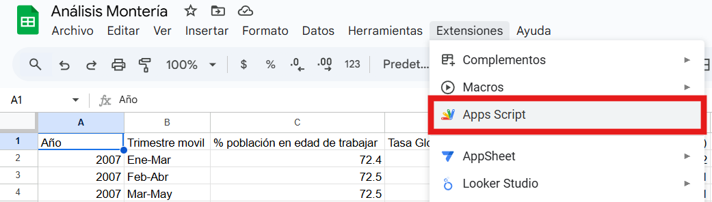
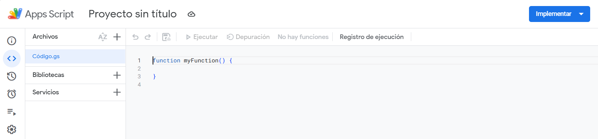
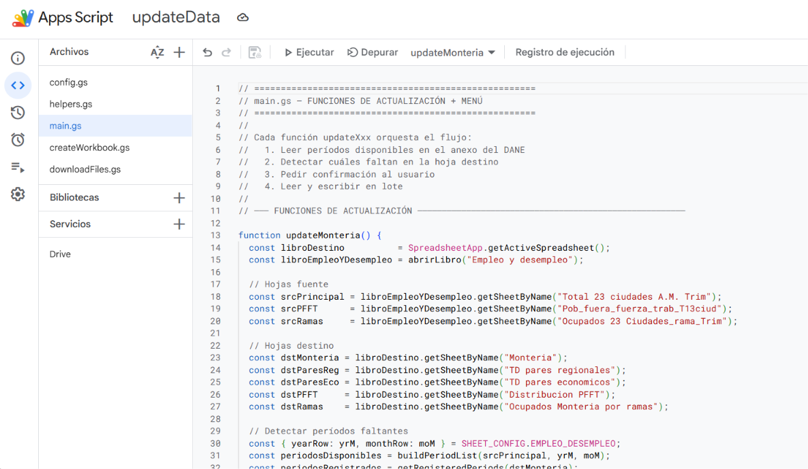
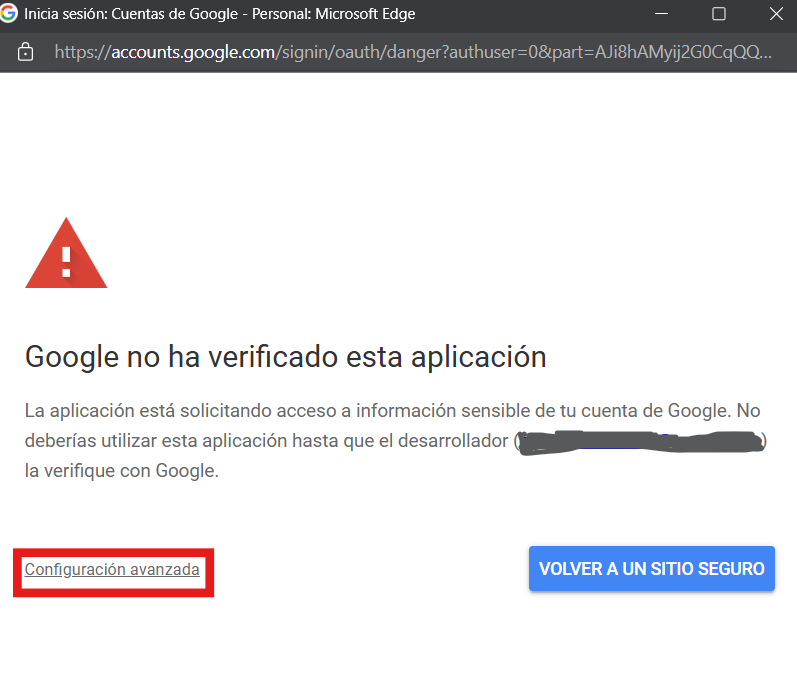
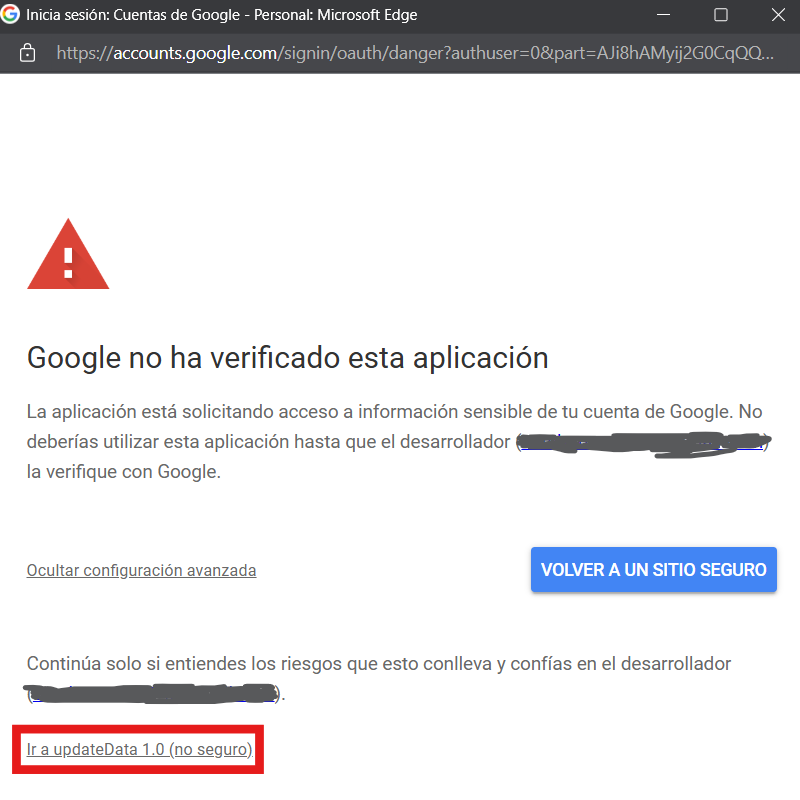
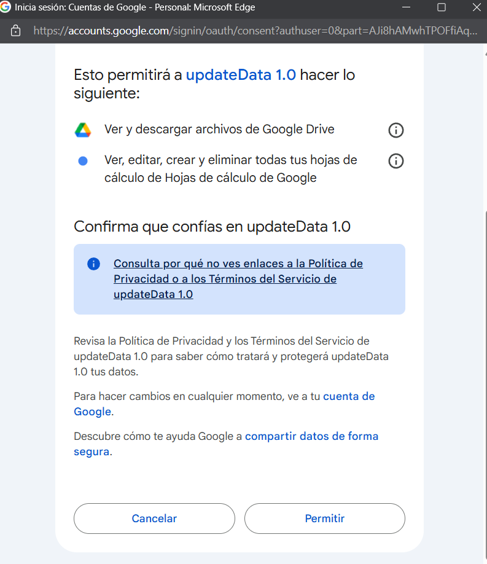
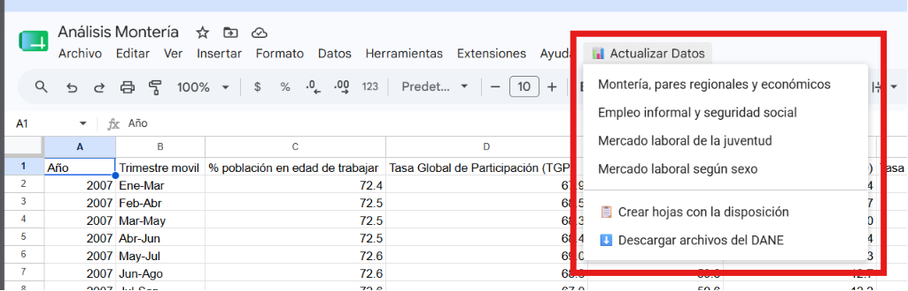

# updateData

[](https://github.com/edr-gh) [](https://www.linkedin.com/in/esteban-dr/)

updateData es un script que permite a su usuario actualizar los datos del mercado laboral para la ciudad de Monteria en un libro de Google Sheets.

El script toma los datos de los anexos técnicos de las encuestas GEIH realizadas por el Departamento Administrativo Nacional de Estadística (DANE) y coloca los datos en una disposición predeterminada en otro libro de Google Sheets. Dicha Disposición es la siguiente:

1. **Libro "Análisis Montería"**
   
    **1.1) hoja "Monteria"**: Datos principales del anexo "Empleo y desempleo" para la ciudad de Montería. Esta hoja contiene, en forma de columnas, los siguientes datos:

    * Año
    * Trimestre movil
    * % población en edad de trabajar
    * Tasa Global de Participación (TGP)
    * Tasa de Ocupación (TO)
    * Tasa de desocupación (TD)
    * Tasa de subocupación (TS)
    * Población total
    * Población en edad de trabajar (PET)
    * Fuerza de trabajo
    * Población ocupada
    * Población desocupada
    * Población fuera de la fuerza de trabajo
    * Subocupados
    * Fuerza de trabajo potencial


    **1.2) hoja "TD Pares regionales"**: Datos de Tasa de desocupación (TD) de las siete capitales de la costa caribe. Tomados del anexo "Empleo y desempleo". Esta hoja contiene, en forma de columnas, los siguientes datos:
    
    * Año
    * Trimestre movil
    * TD-Montería
    * TD-Riohacha
    * TD-Valledupar
    * TD-Santa Marta
    * TD-Barranquilla
    * TD-Cartagena
    * TD-Sincelejo
  

    **1.3) hoja "TD Pares económicos"**: Datos de TD de siete ciudades comparables con Montería por valor agregado al PIB departamental. Tomados del anexo "Empleo y desempleo". Esta hoja contiene, en forma de columnas, los siguientes datos:

    * Año
    * Trimestre movil
    * TD-Montería
    * TD-Neiva
    * TD-Santa Marta
    * TD-Pasto
    * TD-Valledupar
    * TD-Popayán
    * TD-Armenia

    **1.4) hoja "Distribución PFFT"**: Datos de como se distribuye, según la actividad, la Población Fuera de la Fuerza de Trabajo (PFFT) en la ciudad de Montería. Tomados del anexo "Empleo y desempleo". Esta hoja contiene, en forma de columnas, los siguientes datos:

    * Año
    * Trimestre movil
    * Estudiando
    * Oficios del hogar
    * Otros

    **1.5) hoja "Ocupados Monteria por ramas"**: Datos de ocupación por rama de actividad económica. Tomados del anexo "Empleo y desempleo". Esta hoja contiene, en forma de columnas, los siguientes datos:

    * Año
    * Trimestre movil
    * Población ocupada
    * No informa
    * Agricultura, ganadería, caza, silvicultura y pesca
    * Explotación de minas y canteras
    * Industrias manufactureras
    * Suministro de electricidad gas, agua y gestión de desechos
    * Construcción
    * Comercio y reparación de vehículos
    * Alojamiento y servicios de comida
    * Transporte y almacenamiento
    * Información y comunicaciones
    * Actividades financieras y de seguros
    * Actividades inmobiliarias
    * Actividades profesionales, científicas, técnicas y servicios administrativos
    * Administración pública y defensa, educación y atención de la salud humana
    * Actividades artísticas, entretenimiento, recreación y otras actividades de servicios
  

    En el libro de "Análisis Montería" las hojas cuyos datos se obtienen del anexo "Empleo y desempleo" se colorean de verde.

    **1.6) hoja "Formales e informales Monteria"**: Datos sobre ocupados formales e informales en la ciudad de Montería. Tomados del anexo "Empleo informal y seguridad social". Esta hoja contiene, en forma de columnas, los siguientes datos:

    * Año
    * Trimestre movil
    * Población ocupada
    * Formal
    * Informal

    **1.7) Proporción de Informalidad**: Datos sobre el porcentaje de informales con respecto a la población ocupada. Tomados del anexo "Empleo y seguridad social". Esta hoja contiene la proporción de informalidad, en forma de columnas, de las siguientes ciudades:

    * Total nacional
    * 13 Ciudades y A.M.
    * 23 Ciudades y A.M.
    * Bogotá D.C.
    * Medellín A.M.
    * Cali A.M.
    * Barranquilla A.M.
    * Bucaramanga A.M.
    * Manizales A.M.
    * Pasto
    * Pereira A.M.
    * Cúcuta A.M.
    * Ibagué
    * Montería
    * Cartagena
    * Villavicencio
    * Tunja
    * Florencia
    * Popayán
    * Valledupar
    * Quibdó
    * Neiva
    * Riohacha
    * Santa Marta
    * Armenia
    * Sincelejo

    En el libro, las dos hojas anteriores se colorean de rojo porque sus datos provienen del anexo "Empleo informal y seguridad social".

    **1.8) Monteria Joven**: Datos sobre el mercado laboral de la juventud en la ciudad de Monteria. Tomados del anexo "Mercado laboral de la juventud". Adicional, esta hoja la encontramos coloreada de azul. Esta hoja contiene, en forma de columnas, los siguientes datos:

    * Año	
    * Trimestre movil	
    * % PET Joven	
    * TGP Joven	
    * TO Joven	
    * TD Joven	
    * % PFFT Joven/ PET Joven	
    * PET	
    * PET Joven	
    * FT Joven	
    * PO Joven	
    * PD Joven	
    * PFFT Joven

    **1.9) Monteria por sexo**: Datos sobre el mercado laboral según sexo en la ciudad de Monteria. Tomados del anexo "Mercado laboral según sexo". Esta hoja se encuentra coloreada de rosado. Esta hoja contiene, en forma de columnas, los siguientes datos:

    * Año	
    * Trimestre movil	
    * % PET-Hombres	
    * TGP-Hombres	
    * TO-Hombres	
    * TD-Hombres	
    * Población total (Hombres)	
    * PET-Hombres	
    * FT-Hombres	
    * PO-Hombres	
    * PD-Hombres	
    * % PET-Mujeres	
    * TGP-Mujeres	
    * TO-Mujeres	
    * TD-Mujeres	
    * Población total (Mujeres)
    * PET-Mujeres	
    * FT-Mujeres	
    * PO-Mujeres	
    * PD-Mujeres

    
## ¿Cómo usar este script?

### 1. Crear un libro de Google Sheets

Basta con un libro **completamente vacío**: una vez instalado el script, la opción **📋 Crear hojas con la disposición** del menú genera automáticamente las 9 hojas con sus encabezados, pestañas coloreadas y rangos nombrados.

Si prefieres partir de un libro ya armado, también se deja la plantilla [Análisis Montería](https://docs.google.com/spreadsheets/d/16PazXBuSfElwYLePgG1U3qQmb3URxZb4ogVQ925HgiU/edit?gid=1245319174#gid=1245319174). En cualquier caso, los nombres de las hojas deben coincidir exactamente con los indicados en la sección anterior, ya que el script los busca por nombre.

### 2. Insertar el script

Para insertar el script se requiere hacer lo siguiente:

1. Copiar el contenido de los cinco archivos `.gs` de este repositorio: `config.gs`, `helpers.gs`, `main.gs`, `createWorkbook.gs` y `downloadFiles.gs`.
2. Ingresar al libro de Google Sheets donde queremos colocar el script.
3. Ingresar a Apps Script, ingresando a "Extensiones → Apps Script".

<p align="center">
  
  <br><em>Figura 1: Ubicación de Google Apps Script.</em>
</p>

4. Dentro del editor de Apps Script, crear (o reemplazar) cinco archivos llamados `config.gs`, `helpers.gs`, `main.gs`, `createWorkbook.gs` y `downloadFiles.gs`, y pegar en cada uno el contenido correspondiente.

<p align="center">
  
  <br><em>Figura 2: Editor de Apps Script al abrirse por primera vez.</em>
</p>

<p align="center">
  
  <br><em>Figura 3: Editor con los cinco archivos <code>.gs</code> del proyecto cargados.</em>
</p>

5. Habilitar el servicio avanzado de Drive: en el panel izquierdo del editor, junto a "Servicios", hacer click en "+" y añadir **Drive API**. Esto es necesario para que el script pueda convertir los archivos `.xlsx` descargados a Google Sheets.

6. Guardar y recargar el libro de Google Sheets. Al abrirlo, el script registrará automáticamente el menú **📊 Actualizar Datos**.

### 3. Autorizar el script

La primera vez que se ejecute cualquier opción del menú, Google solicitará permisos:

<p align="center">
  
  <br><em>Figura 4: Solicitud de autorización.</em>
</p>

Damos click en "Revisar permisos" y seleccionamos una cuenta de Google:

<p align="center">
  
  <br><em>Figura 5: Selección de cuenta.</em>
</p>

<p align="center">
  
  <br><em>Figura 6: Aviso de Google.</em>
</p>

Google indicará que el script no ha sido verificado. Esto es normal en scripts personales y de código abierto. Para continuar, damos click en "Configuración avanzada":

<p align="center">
  
  <br><em>Figura 7: Configuración avanzada.</em>
</p>

Luego en "Ir a updateData 1.0 (no seguro)":

<p align="center">
  
  <br><em>Figura 8: Permitir el uso del script.</em>
</p>

Y finalmente en "Permitir".

### 4. Uso del menú "📊 Actualizar Datos"

Una vez autorizado el script, el menú queda disponible y muestra seis opciones:

<p align="center">
  
  <br><em>Figura 9: Menú <strong>📊 Actualizar Datos</strong> con las seis opciones disponibles.</em>
</p>

* **Montería, pares regionales y económicos**: actualiza las hojas "Monteria", "TD pares regionales", "TD pares economicos", "Distribucion PFFT" y "Ocupados Monteria por ramas" a partir del anexo "Empleo y desempleo" (hojas verdes).

* **Empleo informal y seguridad social**: actualiza las hojas "Formales e informales Monteria" y "Proporcion de Informalidad" a partir del anexo del mismo nombre (hojas rojas).

* **Mercado laboral de la juventud**: actualiza la hoja "Monteria Joven" a partir del anexo "Mercado laboral de la juventud" (hoja azul).

* **Mercado laboral según sexo**: actualiza la hoja "Monteria por sexo" a partir del anexo "Mercado laboral según sexo" (hoja rosada).

* **📋 Crear hojas con la disposición**: genera, dentro del libro activo, las 9 hojas con sus encabezados, colores de pestaña y rangos nombrados. Es la opción a usar la primera vez sobre un libro vacío. Si alguna hoja ya existe, no se modifica — el proceso es idempotente.

* **⬇️  Descargar archivos del DANE**: descarga directamente desde el sitio del DANE los cuatro anexos requeridos, los convierte a Google Sheets y elimina los `.xlsx` originales. Esta opción reemplaza el paso manual de descargar y renombrar archivos desde [Mercado laboral](https://www.dane.gov.co/index.php/estadisticas-por-tema/mercado-laboral).

#### Flujo típico

1. **(Solo la primera vez, si el libro está vacío)** Hacer click en **📋 Crear hojas con la disposición**. El script muestra qué hojas va a crear, pide confirmación y las inserta en el libro activo. Tras este paso, el libro queda con la estructura esperada y listo para recibir datos.

2. Hacer click en **⬇️  Descargar archivos del DANE**. El script calcula automáticamente la URL del anexo más reciente según la fecha actual. Si un archivo aún no ha sido publicado, ofrece descargar la versión inmediatamente anterior. Si un archivo ya existe en la carpeta, pregunta si se desea reemplazarlo.

3. Hacer click en cualquiera de las cuatro opciones de actualización. El script comparará los períodos disponibles en el anexo contra los períodos ya registrados en el libro destino y mostrará la lista de **períodos faltantes**:

   ```
   Períodos sin registrar (3):

   • Feb-Abr 2026
   • Ene-Mar 2026
   • Dic-Feb 2026

   ¿Continuar?
   ```

   Al confirmar, el script inserta esos períodos en las hojas destino en una sola operación. Si todos los períodos están al día, el script lo informa y no hace nada.

A diferencia de versiones anteriores, el script ya **no solicita el año al usuario**: el año y el trimestre se extraen directamente de las filas de encabezado del anexo del DANE.

## ¿Cómo funciona el script?

El proyecto se organiza en cinco archivos `.gs`. Dos son módulos de soporte sin lógica propia — `config.gs` (constantes que mapean la estructura física de los anexos del DANE) y `helpers.gs` (biblioteca de utilidades reutilizables: parseo de encabezados, comparación contra el destino, lectura/escritura en lote). Los tres restantes implementan las **tres etapas independientes** que el usuario puede invocar desde el menú:

### Generación de la disposición (`createWorkbook.gs`)

Este módulo se encarga del **bootstrap del libro**. Mantiene una tabla declarativa (`DISPOSICION_HOJAS`) con los 9 destinos y, para cada uno, el orden exacto de columnas, el color de pestaña y el nombre del rango nombrado. La función `crearHojasDisposicion`:

* Lee las hojas existentes en el libro activo.
* Detecta cuáles de las 9 hojas faltan.
* Pide confirmación al usuario mostrando qué se va a crear y qué se va a respetar.
* Para cada hoja faltante: la inserta, escribe el encabezado en negrita, congela la fila 1, le aplica el color de pestaña y crea el rango nombrado abarcando inicialmente solo la fila de encabezado. Tras la primera actualización de datos, el rango se redimensiona automáticamente.

El proceso es **idempotente**: si una hoja ya existe, se omite. Si todas existen, el script lo informa y no toca el libro.

### Descarga de anexos (`downloadFiles.gs`)

A partir de la fecha actual, el script construye las URLs de los cuatro anexos en el sitio del DANE:

* `anex-GEIH-<mes><año>.xlsx` para "Empleo y desempleo" (publicación mensual).
* `anex-GEIHEISS-<mes_ini>-<mes_fin><año>.xlsx` para informalidad.
* `anex-GEIHMLS-…` para mercado laboral según sexo.
* `anex-GEIHMLJ-…` para mercado laboral de la juventud.

Para cada URL verifica si el archivo está publicado. Si no lo está (por ejemplo, porque la publicación del DANE aún no ha salido), ofrece como respaldo la URL del período anterior. Después descarga los `.xlsx`, los convierte a Google Sheets vía Drive API y elimina los originales.

### Sincronización incremental de períodos (`main.gs`)

Cada una de las cuatro opciones del menú sigue el mismo patrón:

1. **Leer las filas de encabezado** del anexo correspondiente (una fila con el año y otra con la etiqueta del trimestre) y construir la lista de períodos disponibles. El parser maneja los tres formatos que usa el DANE:
   * `Ene - Mar` (el año se propaga desde la fila de años).
   * `Nov 25 - Ene 26` (el año está dentro de la celda).
   * `Ene - Mar 26` (variante de juventud).

   También normaliza variantes como mayúsculas inconsistentes (`Ene - mar`) y descarta marcadores como el asterisco que el DANE usa para los trimestres afectados por la pandemia.

2. **Leer los períodos ya registrados** en la hoja destino (columnas Año y Trimestre).

3. **Calcular la diferencia** y mostrar al usuario solo los períodos faltantes. Esto permite que el script:
   * Rellene huecos históricos (no solo el último trimestre).
   * Sea idempotente: si se ejecuta dos veces, la segunda no hace nada.

4. **Leer en lote** los datos de las columnas faltantes del anexo y **escribir en lote** en la hoja destino. Toda la lectura y la escritura de cada bloque se hace en una sola llamada a `getRange()`, lo cual reduce drásticamente el tiempo de ejecución frente a actualizar celda por celda.

5. **Actualizar el rango nombrado** asociado a cada hoja para que abarque los datos recién insertados.

### Rangos nombrados (tablas)

Cada hoja destino tiene un rango nombrado que el script redimensiona automáticamente tras cada actualización. Esto permite usar las tablas como fuente de datos en Power BI, Tableau, Looker u otras herramientas, sin necesidad de actualizar referencias manualmente. Los nombres de los rangos son los siguientes:

* **hoja "Monteria"**: En esta hoja la tabla (el rango con nombre)también se llama "Monteria".
* **hoja "TD pares regionales"**: En esta hoja la tabla se llama "TD_Ciudades_costa_caribe".
* **hoja "TD pares economicos**: En esta hoja la tabla se llama "TD_Ciudades_comp_econ".
* **hoja "Distribución PFFT"**: En esta hoja la tabla se llama "Distribucion_PFFT".
* **hoja "Ocupados Monteria por ramas"**: En esta hoja la tabla se llama "ocupados_Monteria_segun_rama".
* **hoja "Formales e informales Monteria"**: En esta hoja la tabla se llama "formales_e_informales".
* **hoja "Proporcion de Informalidad"**: En esta hoja la tabla se llama "Informalidad".
* **hoja "Monteria Joven"**: En esta hoja la tabla se llama "Monteria_Joven".
* **hoja "Monteria por sexo"**: En esta hoja la tabla se llama "Monteria_por_S".

## Autoría

Desarrollado y mantenido por **Esteban Rodríguez**.

Refactorizado y documentado con la asistencia de **Claude Opus 4.8** (Anthropic).
